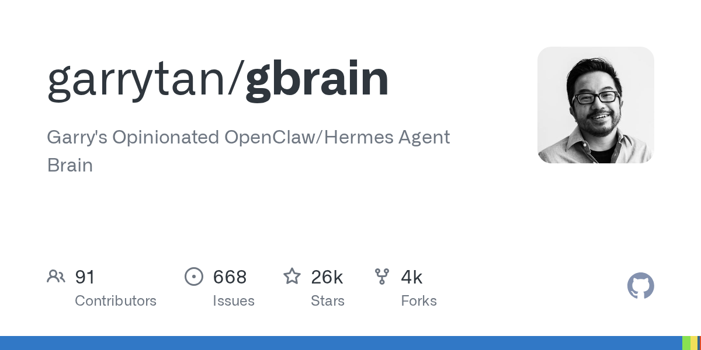
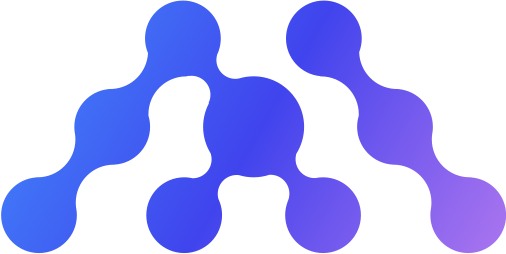
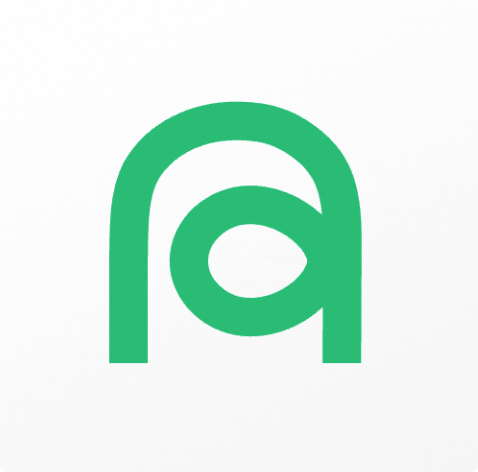
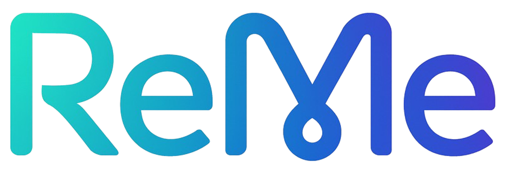
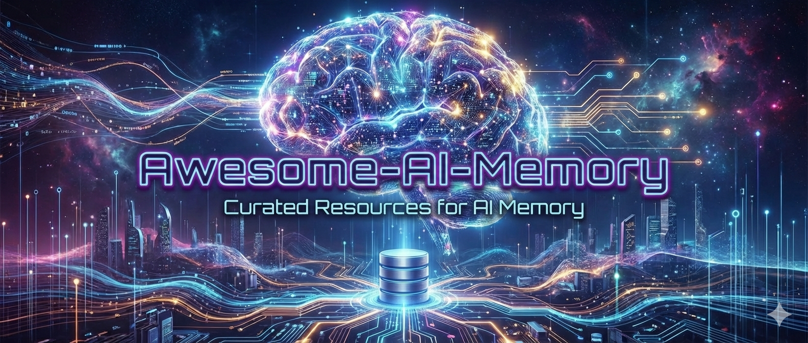
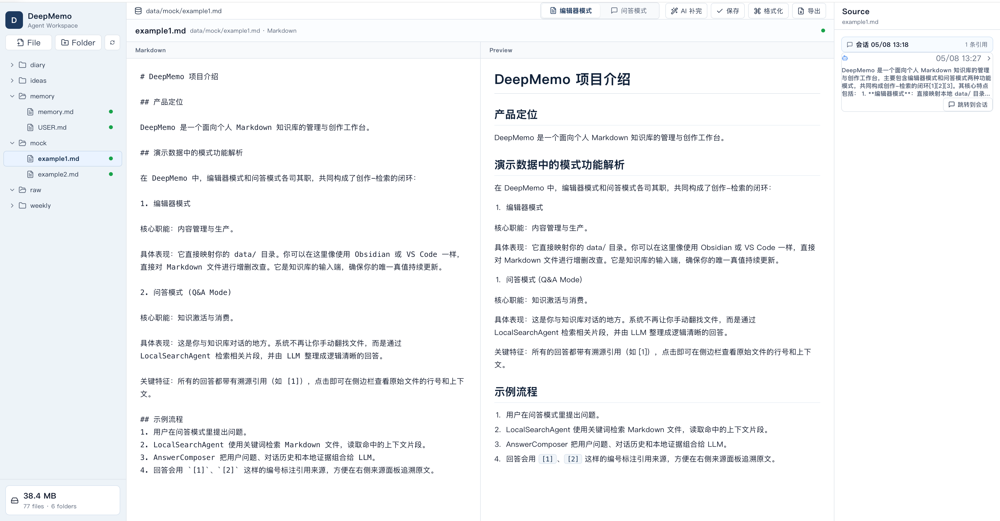








郭子扬，东南大学（SEU）软件工程专业硕士研究生一年级。本科在河海大学读计算机专业（2021-2025年），曾于百度健康担任大模型算法实习生(2025.2-2025.9),主要负责智能客服业务。
 
# 🔍Topics
- ChatBot 
- Agent-Memory     
- Healthcare Intelligence
- AI-Assisted Software Engineering

# 🔥 News
- 2026/6-[把AI真正用进真实项目](https://mp.weixin.qq.com/s/X-34ggGNzJsBaT3-e-9y3Q):Coding Agent可以降低每一行代码生成的成本，却不能稳定降低每一行代码上线并长期运行的成本。我们已经进入了一个代码极度廉价甚至过剩的时代，分享规范使用ai进行工作的经验，阅读2万转发2千
- 2026/5-[主讲东南大学黑客松workshop2](https://www.xiaohongshu.com/discovery/item/69fd7b3b00000000350335fe?source=webshare&xhsshare=pc_web&xsec_token=AB1lJekvt7r-6ERoXNSriwyhGzwulPVNI-xqenuwiI8ME=&xsec_source=pc_share):为大家讲解如何和ai同频共振，以便更好地AI Coding、AI Working
- 2026/4-[东南大学校花校草](https://mp.weixin.qq.com/s/VC-TzLqVNIvsVyMB-r2biw):愚人节看个开心～
- 2026/3-[成为真正的AI Native Coder](https://mp.weixin.qq.com/s/xLgonEJ9cCH0LaLpw76_3g):基于个人开发经历，沉淀AI Codind方法论，阅读2万转发3千
- 2025/12-[优化大模型应用的三个阶段：prompt->sft->rl](https://www.zhihu.com/question/498271491/answer/1978925310432010693):如何判断是自己prompt写的不够好 OR 基座模型的能力不够，才让大模型应用达不到预期效果？这个问题直接决定了后续的技术路径——是继续调prompt、引入RAG还是投入大量成本去做SFT、RL。
- 2025/10-[关于AI Agent设计理念的深度思考](https://mp.weixin.qq.com/s/3DGLUjQ_KP5heVbf3PTTZA):基于ChatBot、DeepResearch相关业务实习经历，总结Agent设计理念，阅读2万转发3千，获字节DeerFlow团队致敬认可
- 2025/9-[25年大模型应用方向：Text2SQL](https://zhuanlan.zhihu.com/p/1915001536171476928):随着模型底座能力与企业数据治理的持续进化，Text2SQL 不再只是问数据库，而是成为驱动业务流程的核心入口，让用户在一次对话中完成检索、决策与执行的全链路操作。我们有望从移动互联网迈向对话互联网

# 🚀 Projects

GitHub

[gbrain](https://github.com/garrytan/gbrain)

- **Contributor**
- YC 总裁 Garry Tan 个人开源的 Agent 大脑层：把检索从"返回 10 个相关页面"升级为"综合引用 + 自走知识图谱 + 缺口分析"三合一，在 240 页 Opus 长文评测上 **P@5 49.1% / R@5 97.9%**，比纯向量 RAG / ripgrep-BM25 高 **+31.4 个百分点**。既是 24/7 个人脑（已跑通 14.6 万页面 / 2.4 万人 / 5300 家公司、66 个 cron job），也能作公司脑按 login 分片隔离、零泄露。

GitHub

[QwenPaw](https://github.com/agentscope-ai/QwenPaw)

- 阿里巴巴AgentScope-**Contributor**
- 阿里开源的个人 AI 助手，本地/云端一键部署：内置 **QwenPaw-Flash（2B/4B/9B）** 本地推理模型，无需 API key 也可跑通；同时兼容 Ollama / LM Studio / 14+ 云端 provider。**三层记忆**：实时工作上下文 + 全量逐字历史 + 蒸馏知识，老对话被淘汰但仍可按需召回。v2.0 重写为 Agent OS 架构（Workspace + Drivers + Sandbox），支持多 agent 并行（ACP）、三栏 Web IDE 的 Coding Mode、Skills/Plugins 市场 + MCP，Channel 覆盖钉钉/飞书/微信/Discord/Telegram/iMessage/QQ。

GitHub

[MemOS](https://github.com/MemTensor/MemOS)

- **Contributor**
- 面向 Agent 的 Memory Operating System：用统一的 API 完成记忆的 add / retrieve / edit / delete。原生支持文本、图像、工具轨迹与 Persona 的多模态记忆；实现跨用户/项目/Agent 的隔离与编排；提供毫秒级异步调度。在LoCoMo 92.34、LongMemEval 93.40，OmniMemEval 等14 个商业记忆产品评测第一。

GitHub

[TencentDB Agent Memory](https://github.com/TencentCloud/TencentDB-Agent-Memory)

- 腾讯犀牛鸟计划-**Contributor**
- 腾讯云开源的 Agent 记忆引擎，主打"符号化短期记忆 + 分层长期记忆"：将冗长的工具日志压缩为 Mermaid 符号图腾，长期记忆按 L0 Conversation → L1 Atom → L2 Scenario → L3 Persona 分层沉淀。集成 OpenClaw / Hermes 后，token 用量最多下降 61.38%，SWE-bench pass rate 相对提升 9.93%。

GitHub

[AgentTeams](https://github.com/agentscope-ai/AgentTeams)

- 阿里巴巴AgentScope-**Contributor**
- 开源的多 Agent 协作运行平台（前身 HiClaw），采用 **Manager-Workers 架构**：Manager 居中调度多个 Worker，OpenClaw / QwenPaw / Hermes 等不同 runtime 可以在同一 Matrix 房间内共存并协同，内置 MinIO 共享文件系统降低 token 消耗、Higress AI Gateway 收敛凭证风险，原生支持人在环上（Human-in-the-Loop）。

GitHub

[ReMe](https://github.com/agentscope-ai/ReMe)

- 阿里巴巴AgentScope-**Contributor**
- Agent 记忆管理工具包，理念是 **Memory as File**：基于 Markdown + frontmatter + wikilink 设计人、 agent 皆可读可用的记忆系统，把对话与外部资料渐进沉淀为可检索、可追溯、可链接的文件型长期记忆。通过 reme CLI + SKILL.md 让任意 agent 都能即插即用。

GitHub

[Awesome-AI-Memory](https://github.com/IAAR-Shanghai/Awesome-AI-Memory)

- **Contributor**
- 面向Agent Memory的持续更新知识库，系统整理记忆系统设计、研究论文、开源框架、基准与实践，当前已积累了 400+ 论文和 100+ 开源项目。个人认为memory是agent时代的数字基建，十分欢迎同行交流～

GitHub

[DeepMemo](https://github.com/YeyezhizzZ/deepmemo)

- **Core Maintainer**
- 本地优先的 Markdown 知识库创作与问答工作台，旨在构建可编辑、可检索、可追溯的个人知识系统，适合长期沉淀学习记录、工程经验和科研进度。

---

# 🏆 Competitions
- 2024, 中国大学生计算机设计大赛全国二等奖
- 2024, 中国大学生服务外包创新创业大赛三等奖

# 🎖 Honors and Awards
- 2026.5，东南大学校运动会拔河亚军（完全干不过土木老哥）
- 2025.6，百度上研大厦跳绳亚军（从现在开始文化生转体育生）
- 2024.11, 河海大学十佳班长（24年全校唯十），所在班集体获评江苏省先进班集体
- 2024.10, 河海大学严恺奖学金（24年全学院唯一，感谢硕士博士前辈谦让了）
- 2023.10, 本科生国家奖学金（梦开始的里程碑） 
- 2021-2025, 河海大学优秀学生奖学金（满勤打卡）
