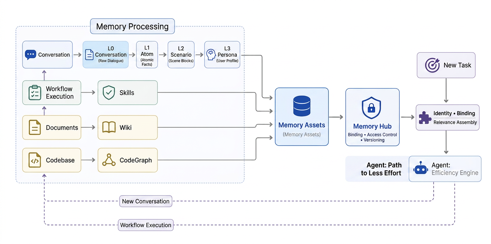
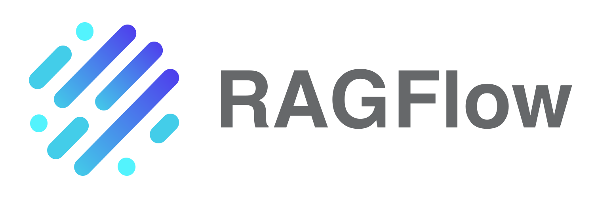
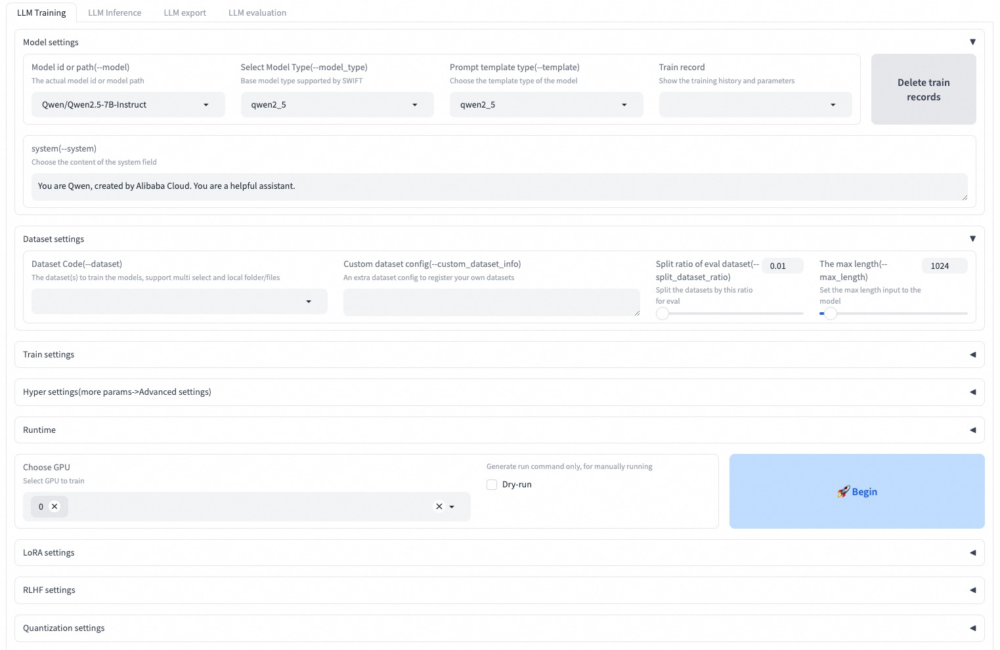








郭子扬，东南大学（SEU）软件工程专业硕士研究生一年级。本科在河海大学读计算机专业（2021-2025年），曾于百度健康担任大模型算法实习生(2025.2-2025.9),主要负责智能客服业务。
 
# 🔍Topics
- ChatBot 
- Agent-Memory     
- Healthcare Intelligence
- AI-Assisted Software Engineering

# 🔥 News
- 2026/9-[从 Agent 开发到 Agent 算法，进阶指南来了](https://mp.weixin.qq.com/s/0YFG-J2ZWwRO4lTP7f1JDA):Datawhale 干货，沉淀 Agent 业务迭代方法论 Benchmark→策略→上线，从 Rubric、LLM-as-Judge/Reward Model 到 Prompt、SFT、RL 全链路拆解
- 2026/6-[把AI真正用进真实项目](https://mp.weixin.qq.com/s/X-34ggGNzJsBaT3-e-9y3Q):Coding Agent可以降低每一行代码生成的成本，却不能稳定降低每一行代码上线并长期运行的成本。我们已经进入了一个代码极度廉价甚至过剩的时代，分享规范使用ai进行工作的经验，阅读2万转发2千
- 2026/5-[主讲东南大学黑客松workshop2](https://www.xiaohongshu.com/discovery/item/69fd7b3b00000000350335fe?source=webshare&xhsshare=pc_web&xsec_token=AB1lJekvt7r-6ERoXNSriwyhGzwulPVNI-xqenuwiI8ME=&xsec_source=pc_share):为大家讲解如何和ai同频共振，以便更好地AI Coding、AI Working
- 2026/4-[东南大学校花校草](https://mp.weixin.qq.com/s/VC-TzLqVNIvsVyMB-r2biw):愚人节看个开心～
- 2026/3-[成为真正的AI Native Coder](https://mp.weixin.qq.com/s/xLgonEJ9cCH0LaLpw76_3g):基于个人开发经历，沉淀AI Codind方法论，阅读2万转发3千
- 2025/12-[优化大模型应用的三个阶段：prompt->sft->rl](https://www.zhihu.com/question/498271491/answer/1978925310432010693):如何判断是自己prompt写的不够好 OR 基座模型的能力不够，才让大模型应用达不到预期效果？这个问题直接决定了后续的技术路径——是继续调prompt、引入RAG还是投入大量成本去做SFT、RL。
- 2025/10-[关于AI Agent设计理念的深度思考](https://mp.weixin.qq.com/s/3DGLUjQ_KP5heVbf3PTTZA):基于ChatBot、DeepResearch相关业务实习经历，总结Agent设计理念，阅读2万转发3千，获字节DeerFlow团队致敬认可
- 2025/9-[25年大模型应用方向：Text2SQL](https://zhuanlan.zhihu.com/p/1915001536171476928):随着模型底座能力与企业数据治理的持续进化，Text2SQL 不再只是问数据库，而是成为驱动业务流程的核心入口，让用户在一次对话中完成检索、决策与执行的全链路操作。我们有望从移动互联网迈向对话互联网

# 🚀 Projects

##  Alibaba AgentScope 生态

GitHub

阿里 Agent 全家桶 Contributor (29 merged PR)。

- **[AgentScope](https://github.com/agentscope-ai/agentscope)**   — 生产级 Agent 框架：Event System / Permission / Workspace / Sandbox / Middleware 等核心抽象，已原生接入 ReMe 长记忆、Agentic Memory、分布式 RAG。
- **[AgentTeams](https://github.com/agentscope-ai/AgentTeams)**   — 多 Agent 协作平台（前身 HiClaw），Manager-Workers 架构，OpenClaw / QwenPaw / Hermes 多 runtime 共存。
- **[QwenPaw](https://github.com/agentscope-ai/QwenPaw)**   — 个人 AI 助手 + Agent OS 架构（Workspace + Drivers + Sandbox），三层记忆 + Coding Mode。
- **[ReMe](https://github.com/agentscope-ai/ReMe)**   — Memory as File 记忆工具包：Markdown + frontmatter + wikilink，人 / agent 皆可读可用。

##  Agent Memory

GitHub

面向 Agent 的记忆 / 上下文 / 知识库生态 Contributor (71 merged PR)。

- **[MemOS](https://github.com/MemTensor/MemOS)**   — Memory Operating System：统一 add / retrieve / edit / delete API；LoCoMo 92.34、LongMemEval 93.40 等 14 个商业记忆产品评测第一。
- **[TencentDB Agent Memory](https://github.com/TencentCloud/TencentDB-Agent-Memory)**   — 腾讯云开源：分层 L0→L3 长期记忆 + 符号化短期记忆，集成后 token 用量最多下降 61.38%。
- **[gbrain](https://github.com/garrytan/gbrain)**   — YC 总裁 Garry Tan 开源的 Agent 大脑层：综合引用 + 自走知识图谱 + 缺口分析，240 页 Opus 长文评测 **P@5 49.1% / R@5 97.9%**。
- **[OpenViking](https://github.com/volcengine/OpenViking)**   — 字节火山引擎 Self-evolving Context Database，统一 Agent Memory / Knowledge RAG / Skills 三层抽象。
- **[Awesome-AI-Memory](https://github.com/IAAR-Shanghai/Awesome-AI-Memory)**   — 面向 Agent Memory 的持续更新知识库（400+ 论文 / 100+ 开源项目）。

##  Open-Source RAG & Deep Research

GitHub

开源 RAG / Deep Research 生态 Contributor (50 merged PR)。

- **[ragflow](https://github.com/infiniflow/ragflow)**   — infiniflow 出品的开源 RAG 引擎（90k+ stars），文档解析 / retrieval / agent orchestration 一条龙。
- **[local-deep-research](https://github.com/LearningCircuit/local-deep-research)**   — 本地优先的 Deep Research 工具（9k+ stars）：llama.cpp / Ollama / Google 等本地与云端 LLM 皆可驱动，10+ 搜索引擎（arXiv / PubMed / 私有文档），SimpleQA ~95%。

##  LLM Post-Training

GitHub

训练 / 后训练框架 Contributor (7 merged PR)。

- **[ms-swift](https://github.com/modelscope/ms-swift)**   — ModelScope 出品的全流程训练框架（AAAI 2025），支持 600+ LLM / 300+ MLLM 的 CPT / SFT / DPO / GRPO。
- **[trl](https://github.com/huggingface/trl)**   — HuggingFace 官方的 Transformer 强化学习库（19k+ stars），SFT / DPO / GRPO / PPO 等 post-training 范式的事实标准。

##  Personal Project

GitHub

- **[DeepMemo](https://github.com/YeyezhizzZ/deepmemo)**  · **Core Maintainer** — 本地优先的 Markdown 知识库创作与问答工作台，适合长期沉淀学习记录、工程经验和科研进度。

---

# 🏆 Competitions
- 2024, 中国大学生计算机设计大赛全国二等奖
- 2024, 中国大学生服务外包创新创业大赛三等奖

# 🎖 Honors and Awards
- 2026.5，东南大学校运动会拔河亚军（完全干不过土木老哥）
- 2025.6，百度上研大厦跳绳亚军（从现在开始文化生转体育生）
- 2024.11, 河海大学十佳班长（24年全校唯十），所在班集体获评江苏省先进班集体
- 2024.10, 河海大学严恺奖学金（24年全学院唯一，感谢硕士博士前辈谦让了）
- 2023.10, 本科生国家奖学金（梦开始的里程碑） 
- 2021-2025, 河海大学优秀学生奖学金（满勤打卡）
